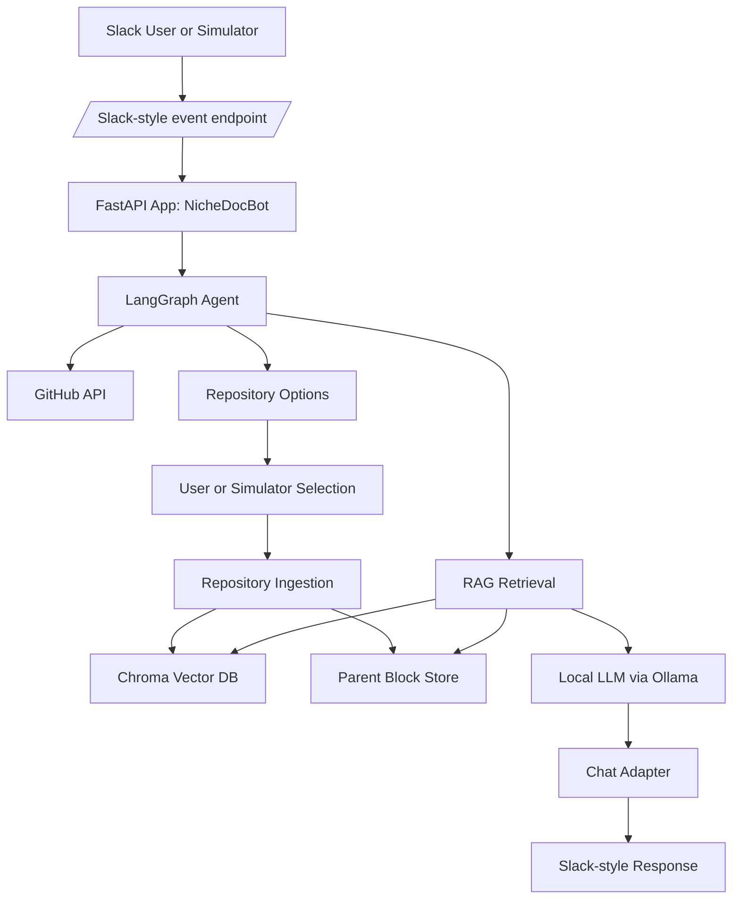
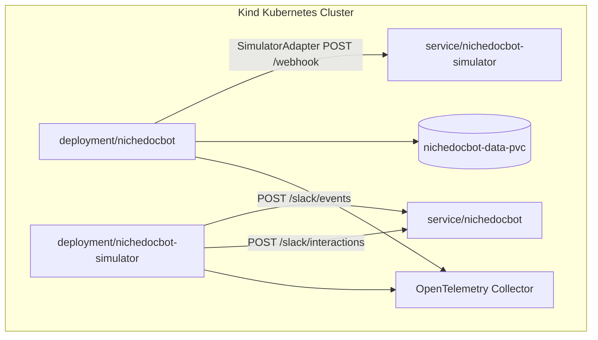
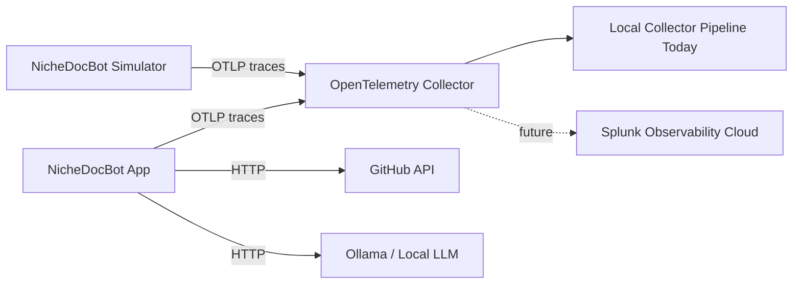

# OpenTelemetry and Observability

NicheDocBot uses OpenTelemetry to make the internal behavior of the app observable during realistic repository search, ingestion, retrieval, and LLM workflows.

The goal is not only to know whether the bot answered, but to understand how the answer was produced: which user request started the flow, which repository was selected, whether the repository needed ingestion, what documents were retrieved, how long the LLM call took, and what response was sent back to the user.

This document explains the current observability design, the simulator-driven telemetry workflow, the local Kubernetes collector, and the planned Splunk Observability Cloud integration.

---

## 1. Why observability matters for this project

NicheDocBot is not a simple request/response chatbot. One user message can trigger a distributed workflow involving Slack-style event handling, LangGraph routing, GitHub API calls, repository ingestion, vector search, local LLM calls, and outbound UI updates.

The application includes multiple asynchronous and multi-step paths:

- Slack-style inbound request handling
- LangGraph execution
- GitHub repository search
- Human-in-the-loop repository selection
- Just-in-time repository sync
- Markdown and multimodal ingestion
- Vector retrieval
- Parent-context reconstruction
- LLM generation
- Outbound Slack-style responses
- Simulator-driven follow-up questions

Without telemetry, debugging these paths depends mostly on logs and manual inspection. OpenTelemetry gives the project a structured way to follow one interaction across services, spans, attributes, and events.

---

## 2. Current observability goal

The current observability goal is to make NicheDocBot explainable from an operations point of view.

For each simulated or real interaction, we want to answer questions such as:

- What user request started the workflow?
- Which Slack channel and thread did it belong to?
- Did the bot find local knowledge or search GitHub?
- Which repository options were returned?
- Which repository was selected?
- Was the repository already up to date?
- If ingestion ran, how far did it progress?
- Which files or documents were processed?
- Which documents were retrieved for the answer?
- How large was the LLM prompt?
- How long did the LLM call take?
- How large was the answer?
- What message was sent back to the user?

The simulator is designed to generate rich telemetry, not only to validate that the application works. Long-running ingestion is acceptable because it creates useful traces for repository processing, progress updates, file parsing, asset fetch failures, retrieval, and LLM answer generation.

The simulator waits until the app sends a terminal “ready for questions” message before starting Q&A. This preserves the real user journey.

---

## 3. At-a-glance architecture

### 3.1 Product workflow



### 3.2 Kubernetes simulator workflow



### 3.3 OpenTelemetry flow



Current state:

```text
Application instrumentation exists.
Simulator traffic generation exists.
A local OpenTelemetry collector exists in Kubernetes.
Splunk Observability Cloud export is planned but not yet implemented.
```

---

## 4. Runtime modes

NicheDocBot currently supports two important Kubernetes runtime modes.

### 4.1 Slack mode

In Slack mode, the real Slack platform sends events to the app and receives responses through the Slack API.

```text
Slack user
  -> Slack Events API
  -> ngrok / public tunnel
  -> nichedocbot app
  -> SlackAdapter
  -> Slack API
```

This mode is useful for validating the real user experience.

### 4.2 Simulator mode

In simulator mode, a Kubernetes workload called `nichedocbot-simulator` drives the same app endpoints that Slack would normally use.

```text
nichedocbot-simulator
  -> POST /slack/events
  -> nichedocbot app
  -> SimulatorAdapter
  -> POST /webhook on nichedocbot-simulator
  -> POST /slack/interactions
  -> nichedocbot app
```

The simulator does not require a polling API such as:

```text
GET /status/{thread_ts}
```

Instead, it listens to outbound UI messages from the app. When the app sends repository selection buttons, the simulator clicks one. When the app sends a terminal “ready for questions” message, the simulator starts asking technical questions.

This is important because the simulator exercises the same product flow as a Slack user:

1. Ask for information about a topic.
2. Receive repository options.
3. Select one repository.
4. Wait for ingestion or up-to-date confirmation.
5. Ask technical questions.
6. Receive RAG/LLM answers.

---

## 5. Current telemetry coverage

| Area | Example span or signal | What it explains |
|---|---|---|
| Inbound message | `slack.process_message` | User request, channel, thread, event metadata |
| Repo search | GitHub / MCP-related spans | What repository options were found |
| Human selection | `slack.ask_for_human_approval` or `simulator_adapter.ask_for_human_approval` | Which repo options were shown |
| Simulator click | simulator interaction log/span | Which repo was selected |
| Ingestion | ingestion/progress spans and update messages | Repository sync progress and file processing |
| Retrieval | RAG retrieval span events | Which documents were retrieved |
| LLM | LLM generation span | Prompt size, response size, latency |
| Outbound response | `slack.send_message`, `slack.update_message`, simulator adapter spans | What the user saw |
| Simulator lifecycle | simulator run-cycle spans/logs | Scenario start, completion, and Q&A activity |

---

## 6. Important spans and attributes

### 6.1 Inbound request span

Expected span:

```text
slack.process_message
```

Purpose:

- Captures the inbound Slack-style event.
- Preserves the Slack channel and thread context.
- Associates the user request with the LangGraph execution thread.

Useful attributes:

```text
slack.channel_id
slack.thread_ts
slack.user_id
slack.event_type
slack.message_length
agent.thread_id
agent.user_request_preview
```

### 6.2 Outbound message spans

Expected spans:

```text
slack.send_message
slack.update_message
slack.ask_for_human_approval
simulator_adapter.send_message
simulator_adapter.update_message
simulator_adapter.ask_for_human_approval
```

Purpose:

- Shows what the bot sent back to the user or simulator.
- Captures message length, block count, image count, and delivery status.
- Helps debug whether progress updates, repository buttons, and final answers were sent.

Useful attributes:

```text
slack.channel_id
slack.thread_ts
slack.message_ts
slack.response_length
slack.has_blocks
slack.block_count
slack.has_images
slack.image_count
slack.api_ok
slack.api_status
```

Simulator adapter attributes:

```text
simulator.webhook_url
simulator_adapter.operation
simulator_adapter.text_length
simulator_adapter.has_blocks
simulator_adapter.block_count
simulator_adapter.has_images
simulator_adapter.image_count
simulator_adapter.post_success
```

### 6.3 Retrieval spans and events

Expected behavior:

- RAG retrieval exposes which documents were retrieved.
- Retrieved documents include source and metadata where available.
- Document retrieval events are attached to the active span.

Example retrieval event:

```text
retrieved_document
```

Useful attributes:

```text
rag.document_index
rag.source
rag.element_type
rag.distance_score
rag.content_preview_length
```

This is important because it allows an operator to understand why a particular answer was generated.

### 6.4 LLM spans

Expected LLM attributes:

```text
llm.approx_prompt_chars
llm.latency_ms
llm.approx_response_chars
llm.response_length
```

Purpose:

- Helps explain latency.
- Helps compare large vs small prompts.
- Helps understand the relationship between retrieved context size and response time.

### 6.5 Ingestion progress telemetry

Repository ingestion is one of the most important telemetry paths in this project.

During ingestion, the app sends progress updates such as:

```text
⏳ Syncing `repo/name`: 40% (20/50 files)
Currently reading: `docs/example.md`
```

These progress updates are useful because they show that the system is not stuck. They also create useful telemetry for long-running repository processing.

Important fields to preserve:

```text
repo_id
processed_files
total_files
percentage
file_path
thread_ts
message_id
```

The `update_message()` call must preserve the correct argument mapping:

```python
await chat_adapter.update_message(
    channel_id=channel_id,
    message_id=message_id,
    text=progress_text,
    thread_ts=thread_ts,
)
```

This avoids accidentally storing progress text as `thread_ts` or confusing message IDs with thread IDs.

---

## 7. Simulator-generated telemetry

The simulator is a traffic generator for observability.

It is designed to create realistic app behavior:

1. Start a topic-based request.
2. Send a Slack-style event to the app.
3. Receive repository choices from the app.
4. Select one repository.
5. Wait for the terminal “ready for questions” message.
6. Send follow-up technical questions.
7. Receive RAG/LLM answers.

The simulator should be visible as its own component in the trace flow when instrumented.

Useful simulator spans or events include:

```text
simulator.run_cycle
simulator.send_user_message
simulator.receive_bot_message
simulator.select_repo
simulator.wait_for_ingestion
simulator.ask_question
simulator.receive_answer
```

Useful simulator attributes include:

```text
simulator.topic
simulator.thread_ts
simulator.selected_repo
simulator.question_count
simulator.ingestion_completed
simulator.answer_received
simulator.operation
```

The simulator should not be treated only as a test harness. It is part of the observability strategy because it continuously generates realistic Slack/GitHub/RAG/LLM traffic.

---

## 8. Terminal message detection

The simulator waits for the app to send a terminal “ready for questions” message before asking follow-up questions.

There are two valid terminal cases.

### 8.1 New repository ingestion completed

Example:

```text
✅ Done! I've fully synced langchain-ai/langgraph. You can now ask me technical questions about it.
```

### 8.2 Repository already exists and is up to date

Example:

```text
✅ pandas-dev/pandas is already completely up to date with the latest GitHub commit.
You can now ask me technical questions about this repository
```

The simulator should detect stable substrings rather than requiring a full exact message match.

Recommended detection logic:

```python
normalized_text = text.lower()

is_terminal_message = (
    "done! i've fully synced" in normalized_text
    or "already completely up to date" in normalized_text
    or "you can now ask me technical questions" in normalized_text
)
```

This allows the simulator to handle both new ingestion and already-up-to-date paths.

---

## 9. Kubernetes collector

The current local Kubernetes environment includes an OpenTelemetry collector service.

Observed resources:

```text
otel-collector-service
otel-collector-lvn4c
otel-collector-t2z6k
```

Service ports:

```text
4317/TCP
4318/TCP
```

These correspond to common OTLP gRPC and OTLP HTTP receiver ports.

The application and simulator should export telemetry to the collector rather than directly to a vendor backend. This keeps the application vendor-neutral.

Conceptual flow:

```text
NicheDocBot app
  -> OTLP
  -> OpenTelemetry Collector
  -> backend exporter
```

Today, the backend exporter is local or not yet finalized. Later, the collector will export to Splunk Observability Cloud.

---

## 10. Current local validation

Until Splunk Observability Cloud is configured, validation is local.

Useful Kubernetes checks:

```bash
kubectl get pods | grep -i otel
kubectl get svc | grep -i otel
kubectl get all | grep -i otel
```

Check app logs:

```bash
kubectl logs deployment/nichedocbot --tail=300
```

Check simulator logs:

```bash
kubectl logs deployment/nichedocbot-simulator --tail=300
```

Check simulator flow:

```bash
kubectl logs deployment/nichedocbot-simulator --tail=500 | grep -E "Starting flow|Simulator selected repo|Webhook received|Terminal|Ingestion complete|Q&A"
```

Expected successful simulator flow:

```text
Starting flow for topic: 'pandas'
Webhook received: text='I found these repositories. Which one should I ingest?'
Simulator selected repo: pandas-dev/pandas
Webhook received: text='✅ pandas-dev/pandas is already completely up to date...'
Terminal state reached: ✅ pandas-dev/pandas is already completely up to date...
Ingestion complete. Starting Q&A barrage...
Webhook received: text='The core architecture of this pandas repository...'
```

If collector pod logs do not show spans, that does not automatically mean telemetry is broken. The collector may not be configured with a logging/debug exporter. Once Splunk Observability Cloud is configured, the primary validation point will move to Splunk APM and dashboards.

---

## 11. Future Splunk Observability Cloud integration

Splunk Observability Cloud is not implemented yet.

The next integration step will be to configure the OpenTelemetry Collector to export telemetry to Splunk Observability Cloud.

Required values:

```text
SPLUNK_ACCESS_TOKEN
SPLUNK_REALM
```

The realm identifies the Splunk Observability Cloud region, such as:

```text
us0
us1
eu0
```

The planned approach is:

1. Get Splunk Observability Cloud access.
2. Create or obtain an Observability access token.
3. Identify the Splunk realm.
4. Install or configure the Splunk OpenTelemetry Collector for Kubernetes.
5. Point the app and simulator OTLP exporters to the collector service.
6. Validate services in Splunk APM.
7. Build dashboards for simulator cycles, ingestion, retrieval, LLM latency, and outbound responses.

Planned Splunk view:

```text
NicheDocBot App
  -> inbound request
  -> GitHub search
  -> repository selection
  -> ingestion / up-to-date check
  -> retrieval
  -> LLM generation
  -> outbound response

NicheDocBot Simulator
  -> scenario start
  -> repo selection
  -> terminal detection
  -> Q&A generation
```

---

## 12. Suggested dashboard sections

Once Splunk Observability Cloud is connected, the dashboard should show:

### 12.1 Application health

- Request count
- Error count
- Latency by endpoint
- App pod status
- Collector export status

### 12.2 Simulator activity

- Cycles started
- Repositories selected
- Q&A questions sent
- Answers received
- Terminal messages detected

### 12.3 Ingestion telemetry

- Ingestion duration
- Files processed
- Progress update count
- Asset fetch failures
- Repositories already up to date
- Repositories requiring full sync

### 12.4 Retrieval quality

- Retrieved document count
- Retrieval distance scores
- Source files used in answers
- Element types retrieved: text, table, tree, image

### 12.5 LLM behavior

- LLM latency
- Approximate prompt size
- Approximate response size
- Error rate
- Slowest requests

### 12.6 Outbound response telemetry

- Slack-style messages sent
- Message updates sent
- Approval messages sent
- Message size
- Block count
- Image count
- API delivery status

---

## 13. Troubleshooting

### Simulator starts but does not continue to Q&A

Check whether the simulator received a terminal message:

```bash
kubectl logs deployment/nichedocbot-simulator --tail=500 | grep -E "Webhook received|Terminal"
```

If it receives the ready message but does not log `Terminal state reached`, check terminal phrase detection.

### App sends repository buttons but simulator does not click

Check simulator logs:

```bash
kubectl logs deployment/nichedocbot-simulator --tail=500 | grep -E "Which one should I ingest|Simulator selected repo"
```

Check that the app is in simulator mode:

```bash
kubectl get deployment nichedocbot -o yaml | grep -A3 -B2 "CHAT_ADAPTER\|SIMULATOR_WEBHOOK_URL\|APP_MODE"
```

Expected:

```text
CHAT_ADAPTER=simulator
SIMULATOR_WEBHOOK_URL=http://nichedocbot-simulator:8080/webhook
APP_MODE=simulator
```

### Progress updates look wrong in telemetry

Verify the `update_message()` call uses keyword arguments:

```bash
kubectl exec deployment/nichedocbot -- sed -n '45,55p' /app/src_v2/rag/ingestion.py
```

Expected:

```python
await chat_adapter.update_message(
    channel_id=channel_id,
    message_id=message_id,
    text=progress_text,
    thread_ts=thread_ts,
)
```

### Collector exists but logs show no spans

This can be normal if the collector is not configured with a logging/debug exporter.

Check collector resources:

```bash
kubectl get pods | grep -i otel
kubectl get svc | grep -i otel
```

Then validate telemetry in the configured backend. Today that backend is local or pending. After Splunk integration, validate in Splunk APM.

---

## 14. Current status

Current completed work:

```text
✅ App emits OpenTelemetry traces
✅ Simulator generates realistic Slack/GitHub/RAG/LLM traffic
✅ Kubernetes app and simulator mode work locally in Kind
✅ Simulator waits for the app's ready-for-questions message
✅ Simulator handles both full ingestion and already-up-to-date terminal messages
✅ update_message argument ordering is fixed
✅ Local OpenTelemetry collector service exists
```

Pending work:

```text
⏳ Splunk Observability Cloud access
⏳ Splunk access token and realm
⏳ Splunk OpenTelemetry Collector configuration
⏳ APM service validation
⏳ Dashboard creation
```

---

## 15. Related documentation

- [Main README](README.md)
- [Simulator Mode Runbook](README-simulator.md)
- [Architecture Overview](docs/architecture-overview.md)
- Future: `docs/splunk-observability.md`
