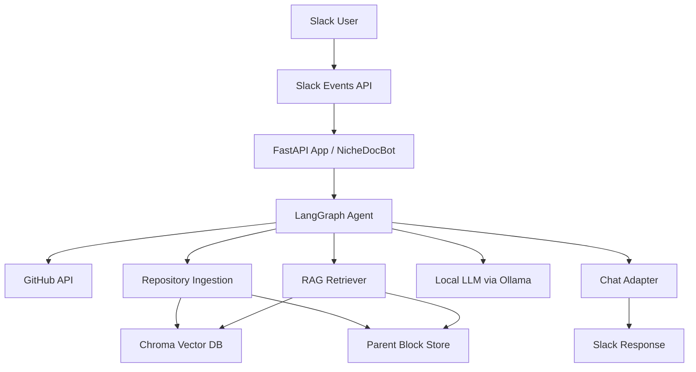
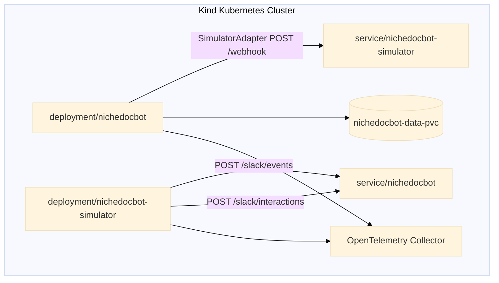
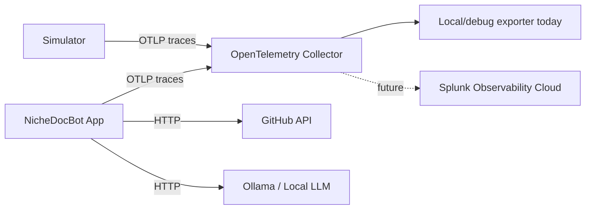

# Project at a glance

### Diagram 1 — Product architecture

```mermaid
flowchart TD
    User[Slack User] --> Slack[Slack Events API]
    Slack --> App[FastAPI App / NicheDocBot]
    App --> Graph[LangGraph Agent]
    Graph --> GitHub[GitHub API]
    Graph --> Ingestion[Repository Ingestion]
    Ingestion --> Chroma[Chroma Vector DB]
    Ingestion --> ParentStore[Parent Block Store]
    Graph --> Retriever[RAG Retriever]
    Retriever --> Chroma
    Retriever --> ParentStore
    Graph --> LLM[Local LLM via Ollama]
    Graph --> Adapter[Chat Adapter]
    Adapter --> SlackResponse[Slack Response]
```

### Diagram 2 — Kubernetes architecture

```mermaid
%%{init: {"theme": "base", "themeVariables": {"backgroundColor": "#f2f2f2"}}}%%
flowchart TD
    subgraph Kind[Kind Kubernetes Cluster]
        AppDeploy[deployment/nichedocbot]
        AppSvc[service/nichedocbot]
        SimDeploy[deployment/nichedocbot-simulator]
        SimSvc[service/nichedocbot-simulator]
        PVC[(nichedocbot-data-pvc)]
        Collector[OpenTelemetry Collector]
    end

    SimDeploy -->|POST /slack/events| AppSvc
    AppDeploy -->|SimulatorAdapter POST /webhook| SimSvc
    SimDeploy -->|POST /slack/interactions| AppSvc
    AppDeploy --> PVC
    AppDeploy --> Collector
    SimDeploy --> Collector
```
### Diagram 3 — OpenTelemetry flow now and future Splunk

```mermaid
flowchart LR
    App[NicheDocBot App] -->|OTLP traces| Collector[OpenTelemetry Collector]
    Simulator[Simulator] -->|OTLP traces| Collector
    Collector --> LocalDebug[Local/debug exporter today]
    Collector -. future .-> Splunk[Splunk Observability Cloud]

    App -->|HTTP| GitHub[GitHub API]
    App -->|HTTP| Ollama[Ollama / Local LLM]
```

